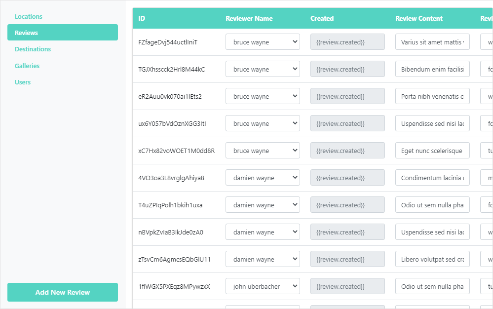

# gratis_web
 
## Description
Gratis Web is a simple web interface designed in VueJS for managing Gratis Flutter data. Since Firestore is a noSQL DB, adding records within the firestore interface can be a pain, so I created this little VueJS app to add in entire records instead of fields at a time.

   



### Installation

```
git clone https://github.com/johnuberbacher/gratis_web.git
```

### Meta

John Uberbacher – [johnuberbacher.com](https://johnuberbacher.com)
